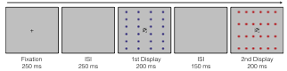

---
authors:
- admin
categories: []
date: "2024-07-25T00:00:00Z"
draft: true
featured: true
gallery_item:

image:
  caption: 'Image credit: [**Unsplash**](https://unsplash.com/photos/CpkOjOcXdUY)'
  focal_point: ""
  preview_only: false
projects: []
subtitle: Studying perception outside the focus of attention
#summary: 
tags: [Inattention, Perceptual Organization]
title: The inattention paradigm
---

The relationship between perception and attention is complex. Perception sometimes can be achieved without attention while other times attention is required. As perception of most visual stimuli require multiple contingent processes, attention can be required for some of them but not others. 

The question of whether or not attention is required for a certain process was addressed by a few studies, using the inattention paradigm. In this paradigm, the observer performs a visual task that is difficult enough to absorb their attention, leaving the rest of the visual field unattended. The experimental manipulation then takes place in the unattended area, and it is assumed that if a perceptual process can be achieved without attention, then the manipulation in the unattended area would affect the performance in the unrelated task the observer is doing. If the process cannot be accomplished without attention, then no effect on performance should be found. 

The latest version of this paradigm was reported by Driver et al. (2001), and has been utilized in several studies after that. Importantly, this version allows for an "online" measure, where the observer's task and the manipulation in the background both include a "change/no change" decision. Thus, in each trial of the experiment, the very conscious decision to respond "same" or "different" to two consecutive displays is accompanied with a unconscious perceptual decision that needs to be made by the visual system about the unattended background. If the two decisions are compatible, then facilitation of the response to the task should occur. If they are not compatible, the unconscious decision may interfere with the conscious one. This, of course, will only be the case if the processes required for the perception of the stimuli in the unattended area do not require attention. And this is how we can investigate which processes requires attention and which do not.

Let's look at an example from Rashal et al. (2017). In that study, the observer performed a difficult change detection task on a black and white matrix at the center of the screen. In the unattended backdrop, the dots were grouped into rows or columns by proximity. 

*This is an example trial, where the target matrix is the same in both consecutive displays and the organization of the dots in the backdrop is different. In this trial, responding "same" to the matrix is not compatible with the "different" response the backdrop should elicit. Thus, if the backdrop is processed and perceived in this state of inattention, then performance would be worse in this condition than in a condition where both matrix and backdrop manipulations elicit a compatible response*.

  

Using this paradigm, we demonstrated differences in attentional demands for different grouping cues, contingent processing, and conditions of competition (see related publications below for more information).

