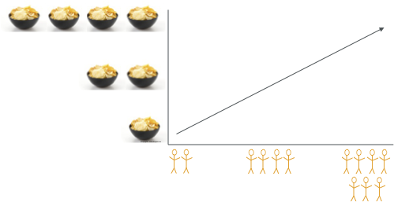

```{r setup, include=FALSE}
knitr::opts_chunk$set(echo = TRUE, fig.path = "static")
```
A linear model **describes a relationship between two variables** - how does one variable changes when a change occurs in the other one?

For example, you know how many snacks you need to buy according to the number of people you invite over to hang out.



**This relationship has only one direction** - when values of one variable increase, the values of the other one can either increase (i.e., a positive correlation), or decrease (i.e., a negative correlation), but never increase for some values and at the same time decrease for others. 

**Regression models are used to make predictions** - once we have computed a linear model and know what the relationship between the variables is, we can predict the value of one variable from a value of the other.


Normally, you wouldn't compute a regression model to plan your shopping for a party. Still, the principle idea is the same when we study human behavior and cognitive mechanisms. 

Let's look at another question - *Is there a relationship between the time spent browsing shows on Netflix until choosing what show to watch and the satisfaction rate given to that show after watching it?*  This question may interest psychologists studying satisfaction, UX experts designing the app interface, or data scientists consulting the company on strategies to prevent customers from canceling their subscriptions. 

The next bits show how to compute, interpret and visualize a linear regression in R using the tidyverse package. The full code and the code for creating the dataset can be found [here](https://github.com/einatrs/lm_tutorial/commit/7c9740da2991f3374e5e9fb5f15eb8a9cbcbb463).

```{r message=FALSE}
library(tidyverse)
#importing the csv file with the data
netflix.ds1 <- read.csv("netflix.ds.csv") #this is a fake dataset. you can find the code to create it in the link above.

#getting an impression of the data 
netflix.ds1 %>% glimpse 

```

The important information here is that we have 1000 observations and 4 variables. The variables we are interested in are in the third and fourth rows: **Browsing_Time** is given in minutes and **Satisfaction** is a rating between 0 (*"that was a waste of time"*) and 10 (*"that show transformed my life!"*).

Now we can compute the regression model. It's very easy. We call the **lm** function and tell it that *Satisfaction* is distributed as a function of *Browsing_Time* :

```{r message=FALSE}
#computing a linear regression
netflix.model.1 <- lm(Satisfaction ~ Browsing_Time, data = netflix.ds1)

```

You will notice that we only specify the two variables whose relationship we are interested in (y,x), but you might recall that the regression formula includes also an intercept (a) and a slope (b): y = a + bx. What the lm function does, is estimate a and b according to the values of y and x provided by the data. 

Let's take a look.


```{r message=FALSE}
summary(netflix.model.1)

```

We can see in the first column of the coefficients section the intercept and the slope for Browsing_Time. The second column contains the estimated intercept and slope, and we can see in the last two columns the significance of the t-tests on these estimations (tested against zero). 

What we are most interested in is the slope - it is highly significant (see the three asterisks), which means it is different than zero (i.e., no correlation), and the estimate for it is positive (0.6210), which means that an increase in browsing time goes with an increase in the satisfaction. More than that, for every minute of browsing time, there is an increase of 0.6 points in the satisfaction rating.

Other important information is given in the last section about R-squared: 0.5009, which means that 50% of the variance in the satisfaction ratings in our data can be explained by the browsing time. 

To plot our data and the regression line we will use ggplot2, which is a part of tidyverse. I also include here commands from the ggpubr package that add the regression formula and R-square from our model.

``` {r message=FALSE}
#making a nice plot with the formula and regression line
library(ggpubr)

netflix.plot1 <- netflix.ds1 %>% ggplot(aes(x=Browsing_Time, y=Satisfaction)) + 
	geom_point() +
	stat_smooth(method="lm", se=F) +
	stat_regline_equation(label.x=11.5, label.y = 4.5, aes(label = ..eq.label..), size=5) +
	stat_regline_equation(label.x=11.5, label.y = 4, aes(label = ..rr.label..), size=5) +
	theme_minimal(base_size = 16)

print(netflix.plot1)

```


