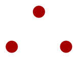
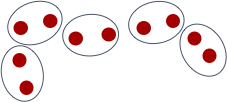
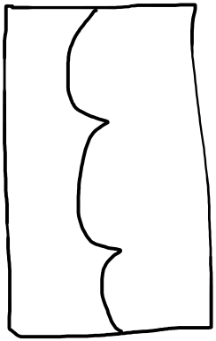
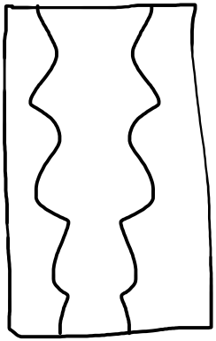
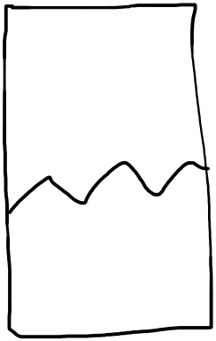
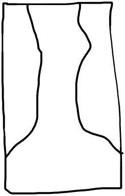

---
authors:
- admin
categories: []
date: "2022-10-26T00:00:00Z"
draft: false
featured: false
gallery_item:

#image:
#  caption: 'Image credit: [**Unsplash**](https://unsplash.com/photos/CpkOjOcXdUY)'
#  focal_point: ""
#  preview_only: false
projects: []
subtitle: Is it a column or a triangle?
summary: The abundance of visual information our brain receives through the eyes is sorted and organized to construct coherent objects
tags: []
title: Perceptual organization makes sense of the world 
---

These two configurations are constructed from the same three red dots, but they are perceived quite differently:
  

How does the brain do that?

**Perceptual organization** is a collection of **cognitive processes** that lead individual pieces of **visual input** to form a **coherent percept**. 

OK, that's a lot to digest, so let's break it down:

*Visual input* - whatever is out there in the world that our eyes make note of, for example colors, lights, shades, locations, shapes, lines, corners, etc.

*Coherent percept* - something that we perceive as a meaningful whole, for example, a red dot, vertical columns, a 3D cube, an arrow, a house, etc.

*Cognitive processes* - mental processes that are responsible for creating our internal world. Some of them link us to our external environment, for example, understanding language or knowing whether to pull or push a door open. Others are mainly internal, like making plans or trying to calculate 6*9 in your head. 

*Perceptual organization* - processes that take colors, lines and locations, and use them to construct an internal representation of a house. 

#### Research in the domain of perceptual organization investigates the computations underlying these processes.

Broadly speaking, we investigate two organizational processes - **grouping** and **figure-ground segmentation**. Grouping processes determine which elements go together and are segregated from other elements. Figure-ground segmentation, or figural-assignment, refers to the process in which one part of the visual field is designated as the figure, while the rest is designated as a background. 

&nbsp;  

**Examples of grouping cues include:**

***Proximity:*** elements that are closer together in space are grouped with each other.
  

***Similarity by color:*** elements that have the same color are grouped with each other.
  

***Similarity by shape:*** elements that have the same shape are grouped with each other.
  

***Similarity by orientation:*** elements that have the same orientation are grouped with each other.
  

***Continuity:*** (also called "good continuation" or "alignment") elements that follow a certain path are grouped with each other.
  

***Common region:*** elements that occupy the same region (i.e., enclosed within the same contour) are grouped with each other.
  

***Connectedness:*** elements that are connected are grouped with each other.
  

&nbsp;  

**Examples of figural-assignment cues include:**

***Convexity:*** a convex area is more likely to be perceived as the figure than a convex area.

***Symmetry:*** a symmetrical area is more likely to be perceived as the figure than an asymmetrical area.

***Lower region:*** the area in the lower region of the visual field is more likely to be perceived as the figure than the area in the upper region.

***Wide base:*** an area with a wider base is more likely to be perceived as the figure than an area with a wider top part.

