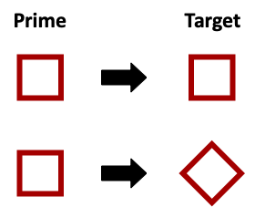
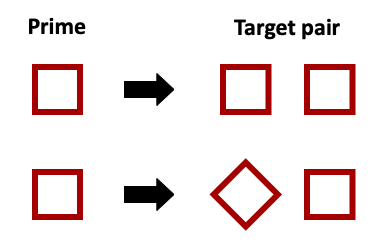

---
authors:
- admin
categories: []
date: "2022-10-27T00:00:00Z"
draft: false
featured: true
gallery_item:

image:
  caption: 'Image credit: [**Unsplash**](https://unsplash.com/photos/CpkOjOcXdUY)'
  focal_point: ""
  preview_only: false
projects: []
subtitle: An indirect measure of perception
summary: Using the priming effect to test unconscious processes in perception
tags: [Perceptual Organization]
title: The primed-matching paradigm
---

One problem in the field of perceptual organization is that we know a lot about our conscious perception of the world, but not so much about the unconscious mental processes underlying it. To address this issue, we need to be creative and develop measures that allow us to "look under the hood" and measure perception indirectly.

You might have heard the term ***priming effect***. This effect describes an improvement in processing time or accuracy resulting from prior exposure to a similar stimulus. In other words, we are generally more efficient at processing something the second time we encounter it.

In most priming experiments two stimuli are presented; the first is the **prime** and the second is the **target**. The participant responds to the target, normally reporting what it depicts, measuring perception *directly*. For example, here the prime is a square and the target is either a square or a diamond. In this case, identifying the square target should take less time than identifying the diamond target. By the way, this happens in milliseconds, so you wouldn't be able to notice it.

To be able to measure perception *indirectly*, that is, without asking the participant what they see, we can add a "twist" to the priming paradigm. This is what Henry Beller did in the primed-matching paradigm (Beller, 1971). Instead of one target, he presented a *target pair*, in which the two target stimuli were the same or not. The participants were asked to report whether the two stimuli in the target pair were the same or different from each other, and the results showed that a priming effect could occur in this case as well; responding "same" was faster then responding "different" when the two stimuli in the target pair were preceded by a prime.

For example, in this case the prime is a square and there are two target pairs, one depicting two squares and the other depicting a square and a diamond. The correct response to the first target pair would be "same" and the correct response to the second target pair would be "different". Presenting the square prime before the target pair reduces the time required for responding "same" for the target pair depicting two squares.

&nbsp;  

## References

Beller, H. K. (1971). Priming: Effects of advance information on matching. *Journal of Experimental Psychology, 87*, 176–182. [http://dx.doi.org/10.1037/h0030553](http://dx.doi.org/10.1037/h0030553)

